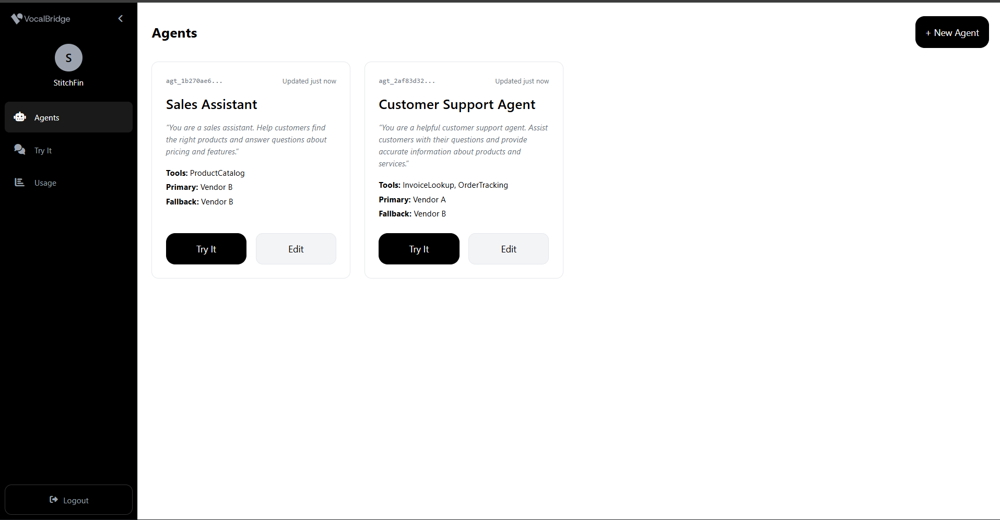
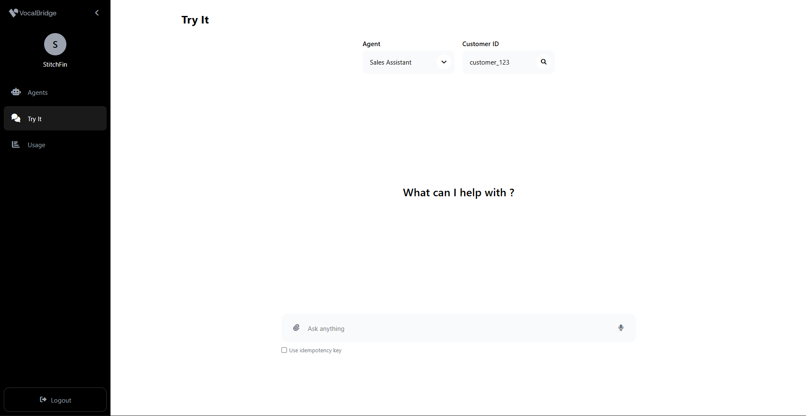
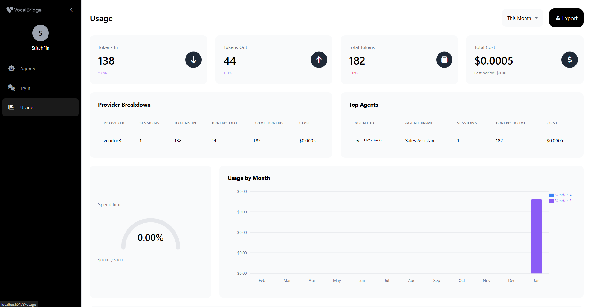

# VocalBridge Ops - Multi-Tenant AI Agent Gateway

A production-grade, multi-tenant AI agent gateway that provides reliable, billed, and observable access to multiple LLM providers with automatic fallback, retry logic, and comprehensive usage tracking.

## Demo Video


https://github.com/user-attachments/assets/ce196c2b-208b-422c-8bad-b356b2a98f3e


## Screenshots

### Login Page


### Agent Management


### Try It - Interactive Chat


### Usage Analytics


## Overview

VocalBridge Ops is a backend-for-frontend (BFF) system that allows multiple tenants to create and manage AI agents backed by different LLM providers (vendorA, vendorB). The system ensures:

- **Multi-tenancy**: Complete tenant isolation with API key authentication
- **Reliability**: Automatic retries, exponential backoff, and fallback to secondary providers
- **Billing accuracy**: Per-token usage tracking with idempotency to prevent double-billing
- **Observability**: Comprehensive usage analytics, cost tracking, and performance metrics
- **Voice support**: Optional voice bot channel with mock STT/TTS (bonus feature)

## Tech Stack

### Backend
- **Runtime**: Node.js 20+ with TypeScript
- **Framework**: Fastify (high-performance HTTP server)
- **Database**: Prisma ORM with SQLite (easily swappable to PostgreSQL/MySQL)
- **Testing**: Vitest
- **Logging**: Pino

### Frontend
- **Framework**: React 19 with TypeScript
- **Build**: Vite
- **Routing**: React Router v7
- **Styling**: Inline styles with CSS variables
- **State**: React hooks + Context API
- **Charts**: Recharts

## Prerequisites

- Node.js 20.19+ or 22.12+
- npm 10+
- Git

## Quick Start

### 1. Clone and Install

```bash
# Clone repository
git clone https://github.com/design-smith/vocalbridge.git
cd StitchFinTH

# Install backend dependencies
cd backend
npm install

# Install frontend dependencies
cd ../frontend
npm install
```

### 2. Setup Database

```bash
cd backend

# Run migrations
npm run db:migrate

# Seed initial data (2 tenants, 3 agents)
npm run seed
```

**Important**: The seed script will output API keys. **Save these immediately** - they cannot be retrieved later!

Expected output:
```
======================================================================
                    SEED COMPLETE - API KEYS
======================================================================

⚠️  IMPORTANT: Save these API keys! They cannot be retrieved later.

Tenant 1: Acme Corporation
  Tenant ID: tnt_xxxxxxxxxxxxx
  API Key:   sk_xxxxxxxxxxxxxxxxxxxxxxxxxxxxx

Tenant 2: GlobalTech Industries
  Tenant ID: tnt_xxxxxxxxxxxxx
  API Key:   sk_xxxxxxxxxxxxxxxxxxxxxxxxxxxxx
```

### 3. Configure Environment Variables

#### Backend
No environment variables required - uses sensible defaults.

Optional `.env` (backend root):
```bash
PORT=3000
HOST=0.0.0.0
LOG_LEVEL=info
NODE_ENV=development
```

#### Frontend
Create `frontend/.env`:
```bash
VITE_API_BASE_URL=http://localhost:3000
```

### 4. Start Services

#### Terminal 1: Backend
```bash
cd backend
npm run dev
```
Backend runs on http://localhost:3000

#### Terminal 2: Frontend
```bash
cd frontend
npm run dev
```
Frontend runs on http://localhost:5173 (or 5174 if 5173 is busy)

## Using the Application

### 1. Login
1. Navigate to http://localhost:5173
2. Enter one of the API keys from the seed output
3. Click "Login"

### 2. Manage Agents
- **View agents**: Navigate to "Agents" page
- **Create agent**: Click "+ New Agent"
  - Choose primary provider (vendorA or vendorB)
  - Optional: Choose fallback provider
  - Enter system prompt
  - Select enabled tools
- **Edit agent**: Click agent card, modify, save

### 3. Try Chat Interface
- **Navigate to**: "Try It" page
- **Select agent**: Dropdown at top
- **Enter customer ID**: For tracking (default: customer_123)
- **Send messages**: Type and press Enter or click send
- **View metadata**: Each assistant response shows:
  - Provider used
  - Tokens (in/out)
  - Cost (USD)
  - Latency (ms)
  - Fallback indicator

#### Idempotency Testing
1. Check "Use idempotency key" checkbox
2. Send a message
3. Copy the idempotency key
4. Send another message with same key
5. **Result**: Second request returns cached response, no duplicate billing

### 4. Voice Messages (Bonus Feature)
- **Start recording**: Click microphone icon (when input is empty)
- **Stop recording**: Click stop button
- **Result**:
  - Audio uploaded to backend
  - Mock STT transcribes to text
  - Agent processes message
  - Mock TTS generates audio response
  - Audio plays automatically

### 5. View Usage & Billing
- **Navigate to**: "Usage" page
- **Select date range**: Default last 7 days
- **View metrics**:
  - Total sessions
  - Total tokens
  - Total cost (USD)
  - Provider breakdown chart
  - Top agents by cost
  - Monthly cost trends
  - Recent usage events table

## API Documentation

All endpoints require authentication via `X-API-Key` header.

### Authentication

#### Get Current Tenant
```bash
curl -H "X-API-Key: sk_xxxxxxxxxxxxx" \
  http://localhost:3000/v1/me
```

Response:
```json
{
  "id": "tnt_xxxxxxxxxxxxx",
  "name": "Acme Corporation",
  "createdAt": "2024-01-01T00:00:00.000Z"
}
```

### Agents

#### List Agents
```bash
curl -H "X-API-Key: sk_xxxxxxxxxxxxx" \
  http://localhost:3000/v1/agents
```

#### Create Agent
```bash
curl -X POST \
  -H "X-API-Key: sk_xxxxxxxxxxxxx" \
  -H "Content-Type: application/json" \
  -d '{
    "name": "My Agent",
    "primaryProvider": "vendorA",
    "fallbackProvider": "vendorB",
    "systemPrompt": "You are a helpful assistant.",
    "enabledTools": ["Tool1", "Tool2"]
  }' \
  http://localhost:3000/v1/agents
```

#### Update Agent
```bash
curl -X PUT \
  -H "X-API-Key: sk_xxxxxxxxxxxxx" \
  -H "Content-Type: application/json" \
  -d '{
    "name": "Updated Agent Name",
    "systemPrompt": "New system prompt"
  }' \
  http://localhost:3000/v1/agents/agt_xxxxxxxxxxxxx
```

### Sessions & Messages

#### Create Session
```bash
curl -X POST \
  -H "X-API-Key: sk_xxxxxxxxxxxxx" \
  -H "Content-Type: application/json" \
  -d '{
    "agentId": "agt_xxxxxxxxxxxxx",
    "customerId": "customer_123",
    "metadata": {"source": "web"}
  }' \
  http://localhost:3000/v1/sessions
```

#### Send Message (with Idempotency)
```bash
curl -X POST \
  -H "X-API-Key: sk_xxxxxxxxxxxxx" \
  -H "Content-Type: application/json" \
  -H "Idempotency-Key: unique-key-12345" \
  -d '{
    "role": "user",
    "content": "Hello, how can you help me?"
  }' \
  http://localhost:3000/v1/sessions/ses_xxxxxxxxxxxxx/messages
```

**Important**: Same `Idempotency-Key` returns cached response without duplicate billing.

#### Get Transcript
```bash
curl -H "X-API-Key: sk_xxxxxxxxxxxxx" \
  http://localhost:3000/v1/sessions/ses_xxxxxxxxxxxxx/transcript
```

### Voice (Bonus)

#### Send Voice Message
```bash
curl -X POST \
  -H "X-API-Key: sk_xxxxxxxxxxxxx" \
  -H "Idempotency-Key: voice-unique-key-12345" \
  -F "audio=@recording.webm" \
  -F "audioDurationMs=5000" \
  http://localhost:3000/v1/sessions/ses_xxxxxxxxxxxxx/voice
```

Response includes:
- `transcriptText`: Mocked transcription
- `assistant`: Agent response
- `audio`: Base64-encoded WAV audio (mock TTS)

### Usage & Analytics

#### Get Usage Rollup
```bash
curl -H "X-API-Key: sk_xxxxxxxxxxxxx" \
  "http://localhost:3000/v1/usage/rollup?from=2024-01-01&to=2024-01-31"
```

#### Get Usage Events
```bash
curl -H "X-API-Key: sk_xxxxxxxxxxxxx" \
  "http://localhost:3000/v1/usage/events?from=2024-01-01&to=2024-01-31&limit=100"
```

#### Get Monthly Usage
```bash
curl -H "X-API-Key: sk_xxxxxxxxxxxxx" \
  http://localhost:3000/v1/usage/monthly
```

## Testing

### Run All Tests
```bash
cd backend
npm test
```

### Run Tests in Watch Mode
```bash
npm run test:ui
```

### Test Coverage
The test suite includes:

**Unit Tests**:
- ✅ Cost calculation (pricing.test.ts)
- ✅ Provider adapter normalization (providers.test.ts)
- ✅ Retry/backoff logic (reliability.test.ts)
- ✅ Utility functions (utils.test.ts)

**Note**: Idempotency is implemented and working in the codebase (see [ConversationService.ts:82-150](backend/src/services/ConversationService.ts#L82-L150)). Integration tests for this feature are planned for future development.

### Run Specific Test File
```bash
npm test -- pricing.test.ts
```

## Database Commands

```bash
cd backend

# Run migrations
npm run db:migrate

# Push schema changes (dev)
npm run db:push

# Generate Prisma client
npm run db:generate

# Open Prisma Studio (DB GUI)
npm run db:studio

# Seed database
npm run seed

# Reset database (⚠️ deletes all data)
npx prisma migrate reset
```

## Known Limitations & Tradeoffs

### Database: SQLite
- **Limitation**: Single-file database, not suitable for production scale
- **Tradeoff**: Easy setup, zero external dependencies, perfect for demo/development
- **Production**: Switch to PostgreSQL or MySQL (Prisma makes this trivial)

### Providers: Mocked
- **Limitation**: vendorA and vendorB are mock implementations
- **Tradeoff**: Deterministic behavior, no API costs, fast tests
- **Production**: Implement real adapters for OpenAI, Anthropic, etc.

### STT/TTS: Mocked
- **Limitation**: Speech-to-Text and Text-to-Speech are mock implementations
- **Tradeoff**: No external API dependencies, deterministic for testing
- **Production**: Integrate OpenAI Whisper, Google Cloud Speech, AWS Polly, etc.

### Authentication: API Keys Only
- **Limitation**: Simple bearer token auth, no JWT/OAuth
- **Tradeoff**: Sufficient for B2B backend API gateway
- **Production**: Consider OAuth2, JWT refresh tokens, or API key rotation

### Rate Limiting: Not Implemented
- **Limitation**: No per-tenant rate limiting
- **Production**: Add Redis-based rate limiting with `@fastify/rate-limit`

### Caching: Minimal
- **Limitation**: Only idempotency caching (in-memory)
- **Production**: Add Redis for distributed caching, agent config caching

## Project Structure

```
StitchFinTH/
├── backend/
│   ├── src/
│   │   ├── api/routes/          # REST API endpoints
│   │   ├── billing/             # Cost calculation & pricing
│   │   ├── channels/voice/      # Voice bot channel (STT/TTS)
│   │   ├── db/                  # Database & repositories
│   │   ├── middleware/          # Auth, request context
│   │   ├── providers/           # LLM provider adapters
│   │   ├── reliability/         # Retry, backoff, fallback
│   │   ├── services/            # Business logic
│   │   ├── utils/               # Helpers, errors, IDs
│   │   ├── seed/                # Database seeding
│   │   └── server.ts            # Main entry point
│   ├── tests/unit/              # Unit tests
│   ├── prisma/
│   │   └── schema.prisma        # Database schema
│   └── package.json
├── frontend/
│   ├── src/
│   │   ├── api/                 # API client & types
│   │   ├── auth/                # Authentication context
│   │   ├── components/          # Reusable UI components
│   │   ├── pages/               # Page components
│   │   ├── utils/               # Formatters, helpers
│   │   └── main.tsx             # Entry point
│   └── package.json
├── README.md                    # This file
├── ARCHITECTURE.md              # System architecture (see below)
└── SUBMISSION_NOTES.md          # Design decisions & tradeoffs

```

## Next Steps (If I Had More Time)

1. **Integration Tests**: E2E tests for idempotency (message + voice), session management, voice flow
2. **Real Providers**: Implement OpenAI, Anthropic Claude adapters
3. **PostgreSQL**: Migrate from SQLite to PostgreSQL for production
4. **Rate Limiting**: Add per-tenant rate limiting with Redis
5. **Agent Versioning**: Track agent config changes over time
6. **Streaming**: Support streaming responses (SSE or WebSockets)
7. **Advanced Analytics**: Usage prediction, cost optimization suggestions
8. **API Key Management**: Rotation, expiration, scoping
9. **Webhook Support**: Notify external systems of events
10. **Docker**: Containerize for easy deployment

## Troubleshooting

### Port Already in Use
```bash
# Kill process on port 3000 (backend)
npx kill-port 3000

# Kill process on port 5173 (frontend)
npx kill-port 5173
```

### Database Locked
```bash
# Stop all backend processes
cd backend
rm prisma/dev.db
npm run db:migrate
npm run seed
```

### API Key Not Working
- Ensure you copied the full key from seed output
- Keys start with `sk_`
- Check you're using the correct tenant's key
- Try re-seeding: `npx prisma migrate reset` then `npm run seed`

### Frontend Can't Connect to Backend
- Check `frontend/.env` has `VITE_API_BASE_URL=http://localhost:3000`
- Restart frontend dev server after changing .env
- Verify backend is running on port 3000
- Check CORS is enabled (it is by default in development)

## Documentation

- **Architecture**: See [ARCHITECTURE.md](./ARCHITECTURE.md) for detailed system design
- **Submission Notes**: See [SUBMISSION_NOTES.md](./SUBMISSION_NOTES.md) for design decisions

## License

ISC

---

**Built with ❤️ for VocalBridge Ops Take-Home Assignment**
